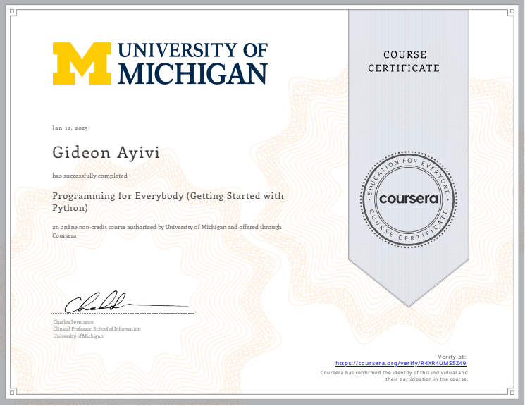
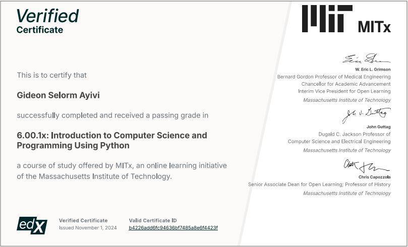

<h1 align="center">OSSU - Computer Science
</h1>

 

<!-- # OSSU Computer Science Journey -->

## 🎯 What This Repository Is About

This repository is dedicated to tracking my journey through the [OSSU Computer Science](https://github.com/ossu/computer-science) curriculum. This curriculum is a complete path to obtaining a strong foundation in computer science, covering a wide range of topics from programming to systems, theory, and applications.

## 📚 What I’m Doing

I am dedicated to self-paced learning, focusing on mastering the fundamentals of computer science. I will document my progress here, including:

- Notes and summaries of key concepts
- Code implementations and projects
- Solutions to problem sets
- Reflections and takeaways from each course

## 📈 Current Progress

### Systematic Program Design - Part 1

| Module                             | Status      |    Notes        |
| ---------------------------------- | --------    | :-------------: |
| 0: Introduction                    | Completed    |         -       |
| 1a: Beginning Student Language     | [Learning about function definition](Core-CS/Systematic-Program-Design/Part-01/1a-BSL/bsl.md#function-definitions) |   [Link](Core-CS/Systematic-Program-Design/Part-01/1a-BSL/bsl.md)   |

---

## 📝 Detailed Learning Path & Progress

The OSSU curriculum contains several topics, each with multiple courses. Below is a table listing all the main areas of study with checkboxes for tracking my progress.

### 📚 Intro CS

#### &#9989; Introduction to Programming

| Courses | Topics covered | Notes | Certificate |
| :-- | :--: | :--: | :--: |
| [Introduction to programming](https://www.coursera.org/learn/python?specialization=python) | `simple programs` `simple data structures` | [Link](Intro-CS\01-Introduction-to-Programming\PY4E\Notes.md) |  |

#### &#9989; Introduction to Computer Science

| Courses | Topics covered |  Notes  | Certificate |
| :-- | :--: | :--: | :--: |
|[Introduction to Computer Science and Programming using Python](https://www.edx.org/learn/computer-science/massachusetts-institute-of-technology-introduction-to-computer-science-and-programming-using-python) | `computation` `imperative programming` `basic data structures and algorithms` | [Link](Intro-CS\01-Introduction-to-Programming\PY4E\Notes.md) |  |

### 📚 Core CS

#### Core Programming

**Topics To Be covered**:
`functional programming`
`design for testing`
`program requirements`
`common design patterns`
`unit testing`
`object-oriented design`
`static typing`
`dynamic typing`
`ML-family languages (via Standard ML)`
`Lisp-family languages (via Racket)`
`Ruby`
`and more`

| Courses | Topics covered | Notes | Certificate |
| :-- | :--: | :--: | :--: |
| [Systematic Program Design](https://learning.edx.org/course/course-v1:UBCx+SPD1x+2T2015) | - | - | - |
| [Class-based Program Design](https://course.ccs.neu.edu/cs2510sp22/index.html) | - | - | - |
| [Programming Languages, Part A](https://www.coursera.org/learn/programming-languages) | - | - | - |
| [Programming Languages, Part B](https://www.coursera.org/learn/programming-languages-part-b) | - | - | - |
| [Programming Languages, Part C](https://www.coursera.org/learn/programming-languages-part-c) | - | - | - |
| [Object-Oriented Design](https://course.ccs.neu.edu/cs3500f19/) | - | - | - |
| [Software Architecture](https://www.coursera.org/learn/software-architecture) | - | - | - |

#### Core math

**Topics To Be covered**:
`discrete mathematics`
`mathematical proofs`
`basic statistics`
`O-notation`
`discrete probability`
`and more`

| Courses | Topics covered | Notes | Certificate |
| :-- | :--: | :--: | :--: |
| [Calculus 1A: Differentiation](https://mitxonline.mit.edu/courses/course-v1:MITxT+18.01.1x/) | - |- | - |
| [Calculus 1B: Integration](https://mitxonline.mit.edu/courses/course-v1:MITxT+18.01.2x/) | - | - | - |
| [Calculus 1C: Coordinate Systems & Infinite Series](https://mitxonline.mit.edu/courses/course-v1:MITxT+18.01.3x/) | - | - | - |
| [Mathematics for Computer Science](https://openlearninglibrary.mit.edu/courses/course-v1:OCW+6.042J+2T2019/about) | - | - | - |

#### CS Tools

**Topics To Be covered**:
`terminals and shell scripting`
`vim`
`command line environments`
`version control`
`and more`

| Courses | Topics covered | Notes |  Certificate |
| :-- | :--: | :--: | :--: |
| [The Missing Semester of Your CS Education](https://missing.csail.mit.edu/) |- |- | - |

#### Core Systems

**Topics To Be covered**:
`procedural programming`
`manual memory management`
`boolean algebra`
`gate logic`
`memory`
`computer architecture`
`assembly`
`machine language`
`virtual machines`
`high-level languages`
`compilers`
`operating systems`
`network protocols`
`and more`

| Courses | Topics covered | Notes |  Certificate |
| :-- | :--: | :--: | :--: |
| [Build a Modern Computer from First Principles: From Nand to Tetris](https://www.coursera.org/learn/build-a-computer) ([alternative](https://www.nand2tetris.org/)) | - | - | - |
| [Build a Modern Computer from First Principles: Nand to Tetris Part II](https://www.coursera.org/learn/nand2tetris2) | - | - | - |
| [Operating Systems: Three Easy Pieces](https://github.com/ossu/computer-science/blob/master/coursepages/ostep/README.md) | - | - | - |
| [Computer Networking: a Top-Down Approach](http://gaia.cs.umass.edu/kurose_ross/online_lectures.htm)| - | - | - |

#### Core Theory

**Topics To Be covered**:
`divide and conquer`
`sorting and searching`
`randomized algorithms`
`graph search`
`shortest paths`
`data structures`
`greedy algorithms`
`minimum spanning trees`
`dynamic programming`
`NP-completeness`
`and more`

| Courses | Topics covered | Notes |  Certificate |
| :-- | :--: | :--: | :--: |
| [Divide and Conquer, Sorting and Searching, and Randomized Algorithms](https://www.coursera.org/learn/algorithms-divide-conquer) | - | - | - |
| [Graph Search, Shortest Paths, and Data Structures](https://www.coursera.org/learn/algorithms-graphs-data-structures) | - | - | - |
| [Greedy Algorithms, Minimum Spanning Trees, and Dynamic Programming](https://www.coursera.org/learn/algorithms-greedy) | - | - | - |
| [Shortest Paths Revisited, NP-Complete Problems and What To Do About Them](https://www.coursera.org/learn/algorithms-npcomplete) | - | - | - |

#### Core Security

**Topics To Be covered**
`Confidentiality, Integrity, Availability`
`Secure Design`
`Defensive Programming`
`Threats and Attacks`
`Network Security`
`Cryptography`
`and more`

| Courses | Topics covered | Notes |  Certificate |
| :-- | :--: | :--: | :--: |
| [Cybersecurity Fundamentals](https://www.edx.org/course/cybersecurity-fundamentals) | - | - | - |
| [Principles of Secure Coding](https://www.coursera.org/learn/secure-coding-principles)| - | - | - |
| [Identifying Security Vulnerabilities](https://www.coursera.org/learn/identifying-security-vulnerabilities) | - | - | - |
| Choose **one** of the following: | | | |
| [Identifying Security Vulnerabilities in C/C++Programming](https://www.coursera.org/learn/identifying-security-vulnerabilities-c-programming) | - | - | - |
| [Exploiting and Securing Vulnerabilities in Java Applications](https://www.coursera.org/learn/exploiting-securing-vulnerabilities-java-applications) | - | - | - |

#### Core Applications

**Topics To Be covered**:
`Agile methodology`
`REST`
`software specifications`
`refactoring`
`relational databases`
`transaction processing`
`data modeling`
`neural networks`
`supervised learning`
`unsupervised learning`
`OpenGL`
`ray tracing`
`and more`

| Courses | Topics covered | Notes |  Certificate |
| :-- | :--: | :--: | :--: |
| [Databases: Modeling and Theory](https://www.edx.org/course/modeling-and-theory)| - | - | - |
| [Databases: Relational Databases and SQL](https://www.edx.org/course/databases-5-sql)| - | - | - |
| [Databases: Semistructured Data](https://www.edx.org/course/semistructured-data)| - | - | - |
| [Machine Learning](https://www.coursera.org/specializations/machine-learning-introduction)| - | - | - |
| [Computer Graphics](https://www.edx.org/course/computer-graphics-2) ([alternative](https://cseweb.ucsd.edu/~viscomp/classes/cse167/wi22/schedule.html))| - | - | - |
| [Software Engineering: Introduction](https://www.edx.org/learn/software-engineering/university-of-british-columbia-software-engineering-introduction) | - | - | - |

#### Core Ethics

**Topics To Be covered**:
`Social Context`
`Analytical Tools`
`Professional Ethics`
`Intellectual Property`
`Privacy and Civil Liberties`
`and more`

| Courses | Topics covered | Notes |  Certificate |
| :-- | :--: | :--: | :--: |
| [Ethics, Technology and Engineering](https://www.coursera.org/learn/ethics-technology-engineering)| - | - | - |
| [Introduction to  Intellectual Property](https://www.coursera.org/learn/introduction-intellectual-property)| - | - | - |
| [Data Privacy Fundamentals](https://www.coursera.org/learn/northeastern-data-privacy)| - | - | - |

### 📚 Advanced CS

#### |  Advanced Programming

**Topics To Be covered**:
`debugging theory and practice`
`goal-oriented programming`
`parallel computing`
`object-oriented analysis and design`
`UML`
`large-scale software architecture and design`
`and more`

| Courses | Topics covered | Notes |  Certificate |
| :-- | :--: | :--: | :--: |
| [Parallel Programming](https://www.coursera.org/learn/scala-parallel-programming)| - | - | - |
| [Compilers](https://www.edx.org/course/compilers) | - | - | - |
| [Introduction to Haskell](https://www.seas.upenn.edu/~cis194/fall16/)| - | - | - |
| [Learn Prolog Now!](https://www.let.rug.nl/bos/lpn//lpnpage.php?pageid=online) ([alternative](https://github.com/ossu/computer-science/files/6085884/lpn.pdf))*| - | - | - |
| [Software Debugging](https://www.youtube.com/playlist?list=PLAwxTw4SYaPkxK63TiT88oEe-AIBhr96A)| - | - | - |
| [Software Testing](https://www.youtube.com/playlist?list=PLAwxTw4SYaPkWVHeC_8aSIbSxE_NXI76g) | - | - | - |

(*) book by Blackburn, Bos, Striegnitz (compiled from [source](https://github.com/LearnPrologNow/lpn), redistributed under [CC license](https://creativecommons.org/licenses/by-sa/4.0/))

#### Advanced Systems

**Topics covered**:
`digital signaling`
`combinational logic`
`CMOS technologies`
`sequential logic`
`finite state machines`
`processor instruction sets`
`caches`
`pipelining`
`virtualization`
`parallel processing`
`virtual memory`
`synchronization primitives`
`system call interface`
`and more`

| Courses | Topics covered | Notes |  Certificate |
| :-- | :--: | :--: | :--: |
| [Computation Structures 1: Digital Circuits](https://learning.edx.org/course/course-v1:MITx+6.004.1x_3+3T2016) [alternative 1](https://ocw.mit.edu/courses/6-004-computation-structures-spring-2017/) [alternative 2](https://ocw.mit.edu/courses/6-004-computation-structures-spring-2009/) | - | - | - |
| [Computation Structures 2: Computer Architecture](https://learning.edx.org/course/course-v1:MITx+6.004.2x+3T2015) | - | - | - |
| [Computation Structures 3: Computer Organization](https://learning.edx.org/course/course-v1:MITx+6.004.3x_2+1T2017) | - | - | - |

#### Advanced Theory

**Topics To Be covered**:
`formal languages`
`Turing machines`
`computability`
`event-driven concurrency`
`automata`
`distributed shared memory`
`consensus algorithms`
`state machine replication`
`computational geometry theory`
`propositional logic`
`relational logic`
`Herbrand logic`
`game trees`
`and more`

| Courses | Topics covered | Notes |  Certificate |
| :-- | :--: | :--: | :--: |
| [Theory of Computation](https://ocw.mit.edu/courses/18-404j-theory-of-computation-fall-2020/) ([alternative](http://aduni.org/courses/theory/index.php?view=cw)) | - | - | - |
| [Computational Geometry](https://www.edx.org/course/computational-geometry) | - | - |- |
| [Game Theory](https://www.coursera.org/learn/game-theory-1) | - | - | - |

#### Advanced Information Security

| Courses | Topics covered | Notes |  Certificate |
| :-- | :--: | :--: | :--: |
| [Web Security Fundamentals](https://www.edx.org/course/web-security-fundamentals) | - | - | - |
| [Security Governance & Compliance](https://www.coursera.org/learn/security-governance-compliance) | - | - | - |
| [Digital Forensics Concepts](https://www.coursera.org/learn/digital-forensics-concepts) | - | - | - |
| [Secure Software Development: Requirements, Design, and Reuse](https://www.edx.org/course/secure-software-development-requirements-design-and-reuse) | - | - | - |
| [Secure Software Development: Implementation](https://www.edx.org/course/secure-software-development-implementation) | - | - | - |
| [Secure Software Development: Verification and More Specialized Topics](https://www.edx.org/course/secure-software-development-verification-and-more-specialized-topics) | - | - | - |

### Advanced Math

| Courses | Topics covered | Notes |  Certificate |
| :-- | :--: | :--: | :--: |
| [Essence of Linear Algebra](https://www.youtube.com/playlist?list=PLZHQObOWTQDPD3MizzM2xVFitgF8hE_ab) | - | - | - |
| [Linear Algebra](https://ocw.mit.edu/courses/mathematics/18-06sc-linear-algebra-fall-2011/) | - | - | - |
| [Introduction to Numerical Methods](https://ocw.mit.edu/courses/mathematics/18-335j-introduction-to-numerical-methods-spring-2019/index.htm)| - | - | - |
| [Introduction to Formal Logic](https://forallx.openlogicproject.org/) | - | - | - |
| [Probability](https://projects.iq.harvard.edu/stat110/home) | - | - | - |

### 📚 Final Project

| Courses | Topics covered | Notes |  Certificate |
| :-- | :--: | :--: | :--: |
| [Fullstack Open](https://fullstackopen.com/en/) | - | - | - |
| [Modern Robotics (Specialization)](https://www.coursera.org/specializations/modernrobotics) | - | - | - |
| [Data Mining (Specialization)](https://www.coursera.org/specializations/data-mining) | - | - | - |
| [Big Data (Specialization)](https://www.coursera.org/specializations/big-data) | - | - | - |
| [Internet of Things (Specialization)](https://www.coursera.org/specializations/internet-of-things) | - | - | - |
| [Cloud Computing (Specialization)](https://www.coursera.org/specializations/cloud-computing) | - | - | - |
| [Data Science (Specialization)](https://www.coursera.org/specializations/jhu-data-science) | - | - | - |
| [Functional Programming in Scala (Specialization)](https://www.coursera.org/specializations/scala) | - | - | - |
| [Game Design and Development with Unity 2020 (Specialization)](https://www.coursera.org/specializations/game-design-and-development) | - | - | - |

---

## 🚀 How This Repo Will Evolve

As I complete each course, I will:

- Upload notes and projects for each topic.
- Create a dedicated folder for each course, containing assignments, code files, and additional resources.
- Share my learnings and key takeaways in the form of blog posts or video tutorials.

Stay tuned for more updates as I continue through the OSSU curriculum!

---

### 👤 Author

- [SelormDev](https://selormdev.com)
- [LinkedIn](https://www.linkedin.com/in/selormdev)

### 🛠️ Tools & Technologies

- Python
- JavaScript
- DrRacket
- Git & GitHub

### 📜 License

This repository is licensed under the [MIT License](./LICENSE).
